# Quasi-Direct-Drive-Actuator

This is on-going Open-Source Project of Cycloidal Quasi-Direct Drive. So I'm going to upload updated Image and Video continuously. You can look forward to my Project!!

CAD files are available in 'Mechanical_CAD_Design' Folder
Commercial Off-The-Shelf Components are Listed in OFF_THE_SHELF_SPECIFICATIONS

## CAD Design Overview
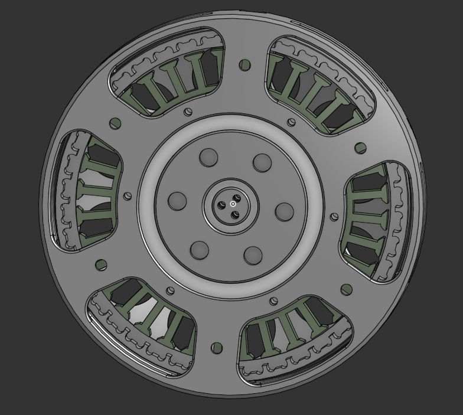

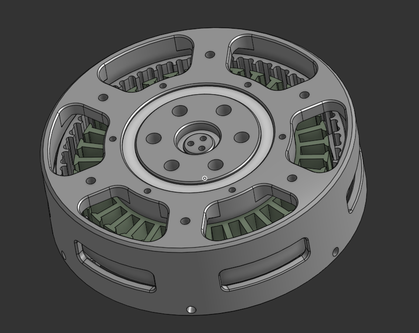

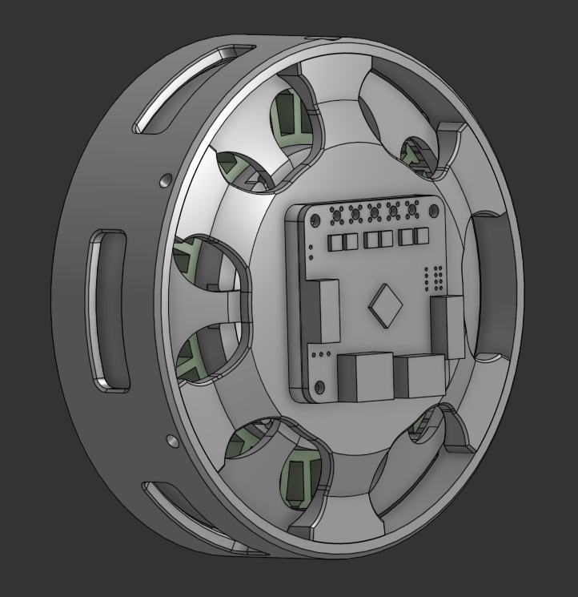

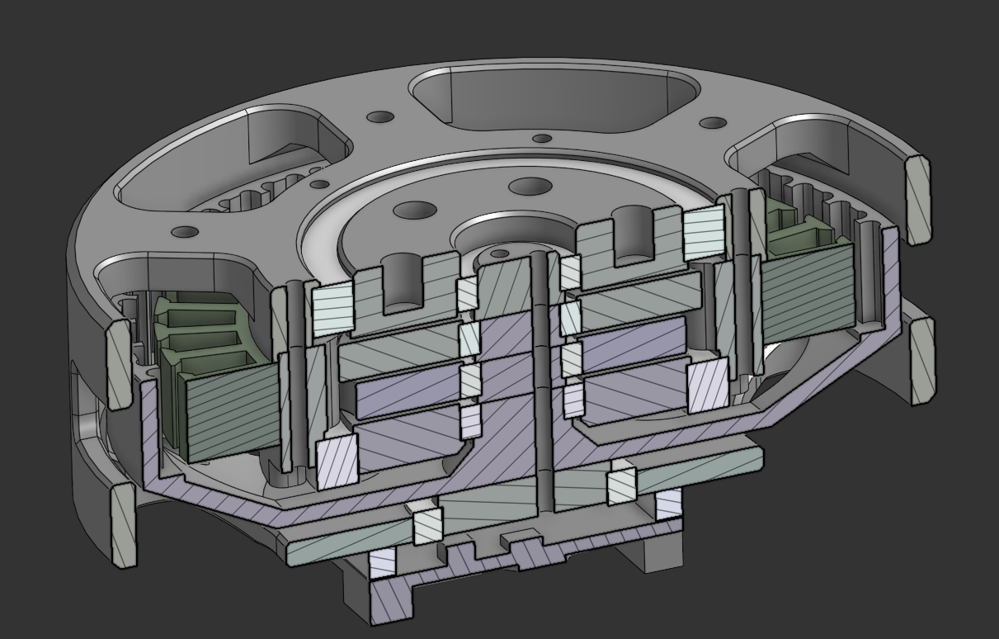

## Material Selection per each parts

### Housing : PA12-CF 
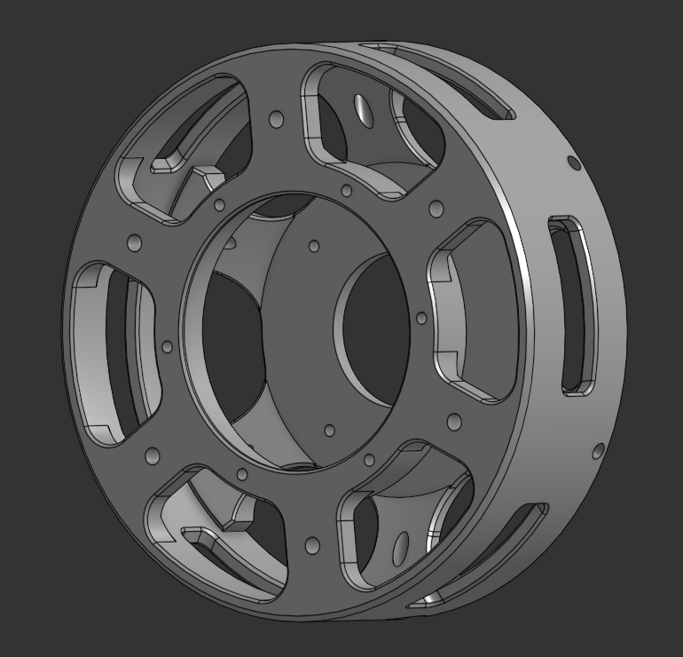

### Gears : Aluminium 6061 (bead blasting + Hardcoat Anodizing)
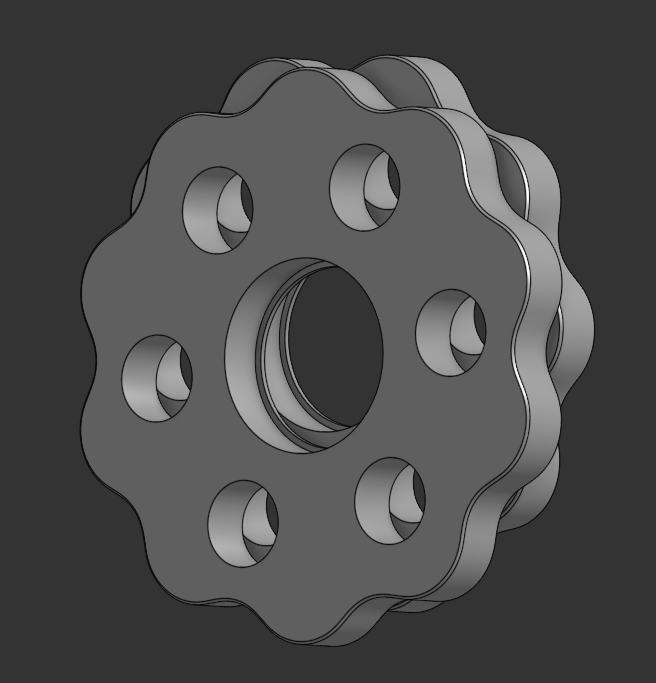

### Input Shaft & Rotor: Aluminium 6061 (bead blasting + Anodizing)
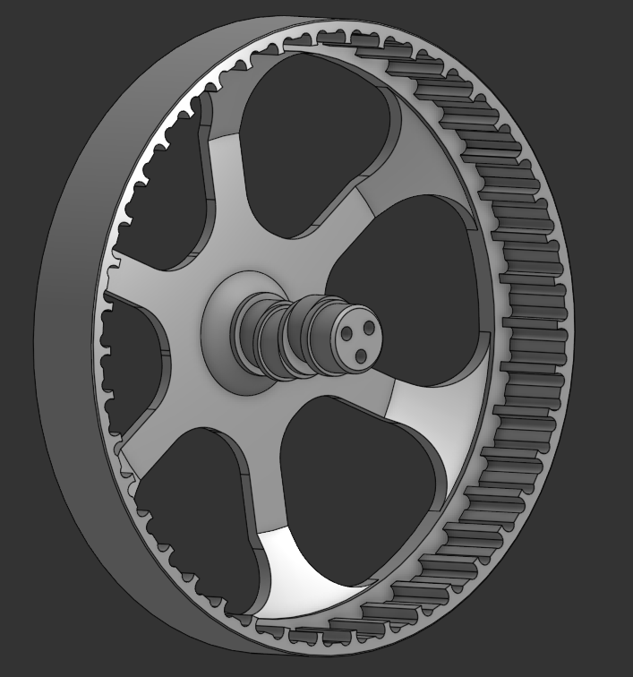
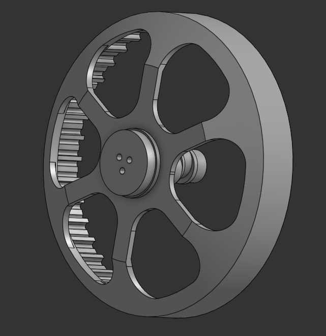

### Output Shaft : PA12-CF
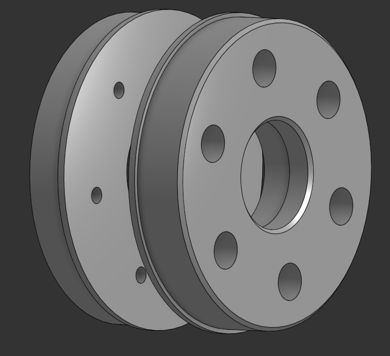

### Outer Gear : PA12-CF + 'stainless steel shaft'(off-the-shelf, only contact faces) / Aluminium 6061
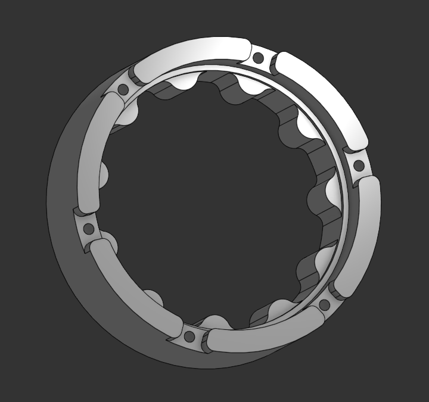

### Coupler : Housing to Rotor

## Off-The-Shelf Parts
### Bearings / Stator / FOC Controller
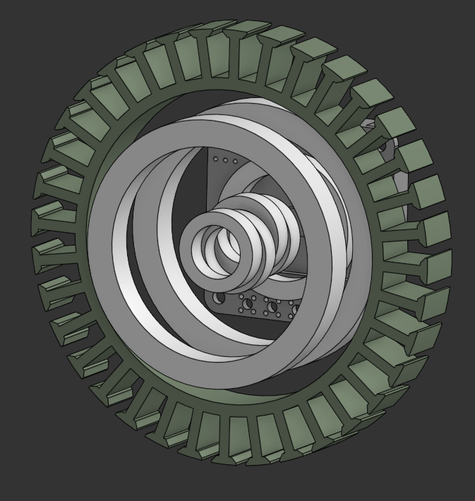

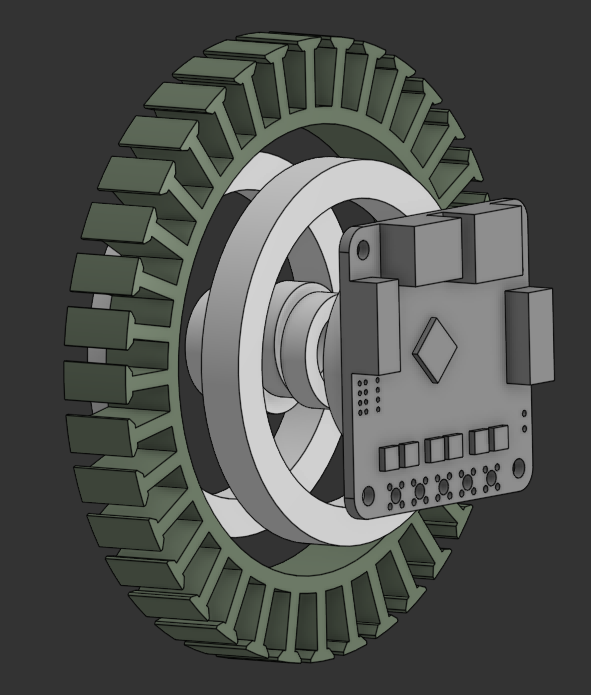

# Assembly

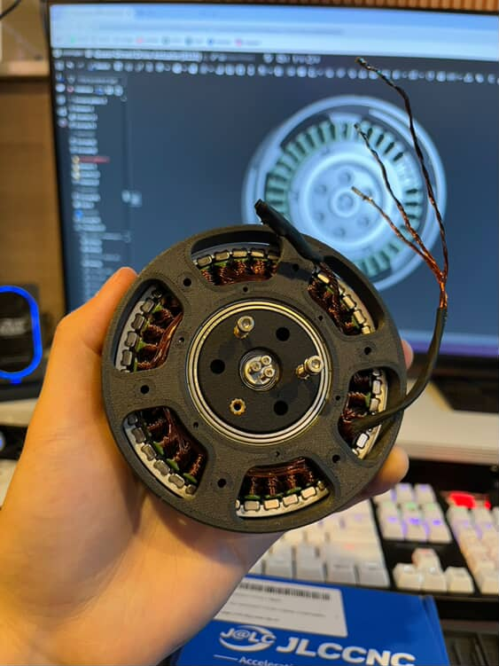

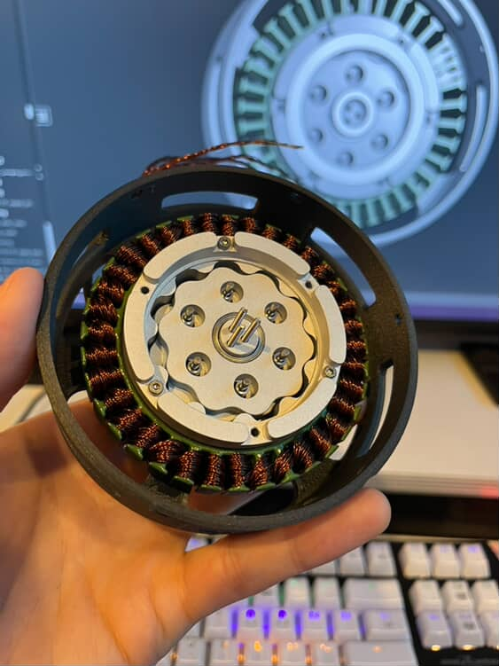

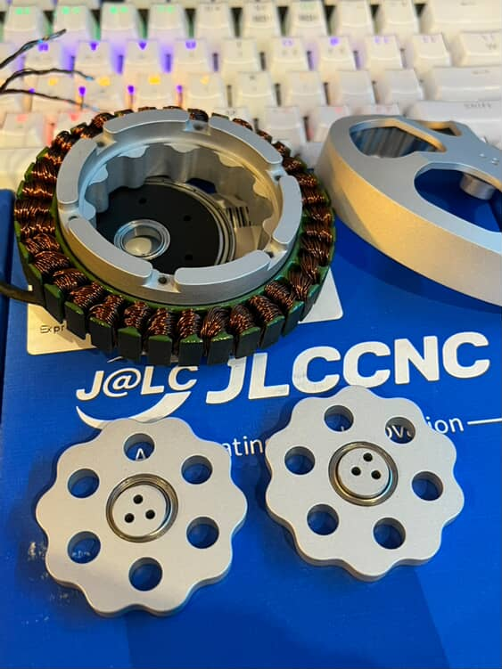

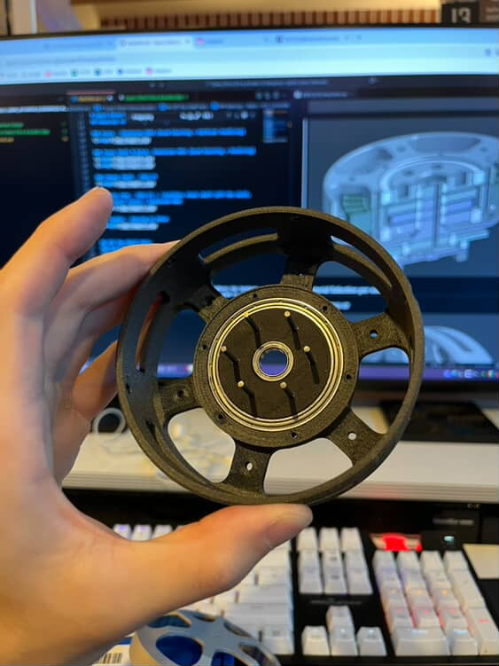

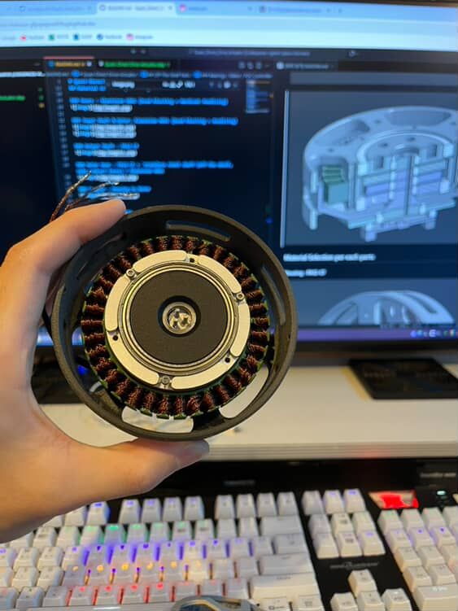

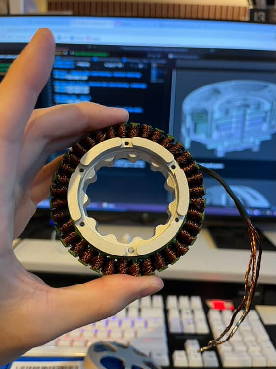

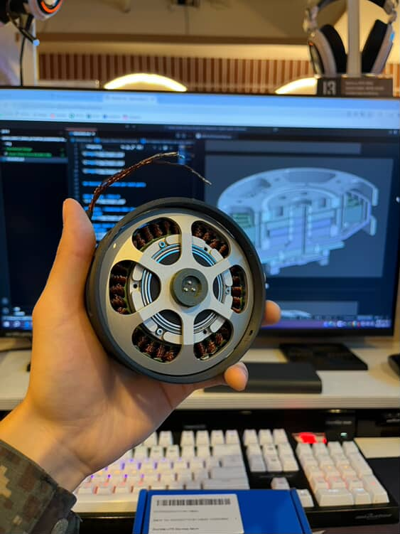

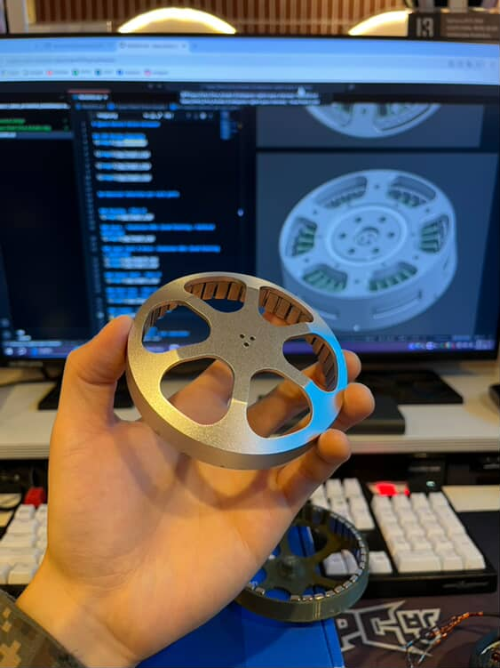

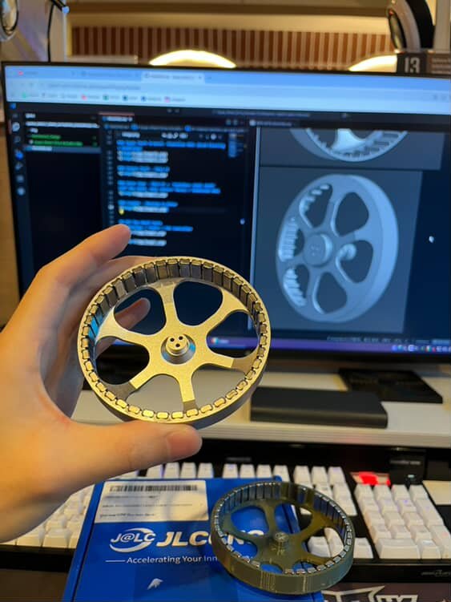
