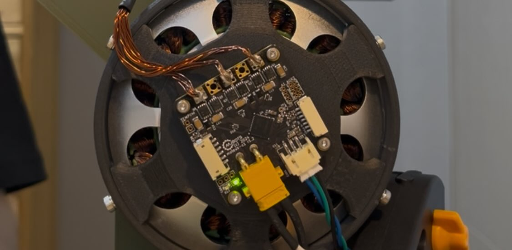
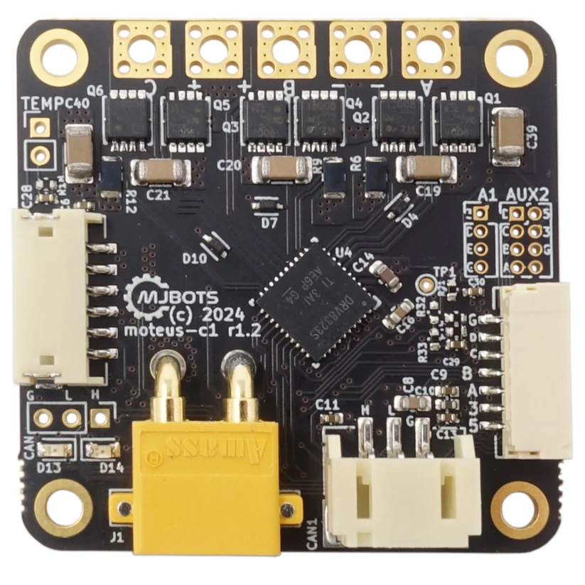

# Cycloidal QDD Actuator for Dynamic Robots

> *Custom-designed Quasi-Direct Drive (QDD) actuator featuring a low ratio reducer with 1:10 improving Backdrivability and Responsiveness. And It has over 7Nm Max Holding Torque(not accurately measured yet)*

Table of contents

- [0. Repository Layout](#0-layout)
- [1. Project Overview](#1-project-overview)
- [2. Actuator Design : Why QDD Actuator](#2-actuator-design-why-qdd-actuator)
- [3. System Architecture & Components](#3-system-architecture--components)
- [4. Fabrication & Assembly](#4-fabrication--assembly)
- [5. Control & Validation](#5-control--validation)

---

## 0. layout
- Mechanical_CAD_Design/ — CAD models(assembly file) (STEP/Source)  
- Motor_Control/ — Sources(if you're using esp32/arduino and drv8302 motor driver)
- Mechanical_IMG/ — photos and renders used in this README  
- OFF_THE_SHELF_SPECIFICATIONS/ — commercial component specs (bearings, shafts, controllers etc)  
- BOM/ — Bill of Materials (preparing)

## 1. Project Overview
This project focuses on the design, fabrication, and control of a custom actuator intended for a **future humanoid robot platform**. To achieve dynamic human-robot interaction, the actuator is designed based on the **Quasi-Direct Drive (QDD)** architecture with Cycloidal Reducer, prioritizing back-drivability, responsiveness and torque density over pure holding force.

The project involves complex mechanical design (cycloidal gearing), electromagnetic integration (custom rotor/stator), and advanced motor control (Moteus-c1 FOC driver).

* **Role:** Mechanical Design, Fabrication, Motor Winding, Control Implementation
* **Manufacturing Partner:** [JLCCNC](https://jlcpcb.com/cnc) (CNC Machining)
* **Status:** Prototype Assembly & Validation is ongoing

  <table>
    <tr>
      <td></td>
      <td></td>
    </tr>
  </table>

---

## 2. Actuator Design: Why QDD Actuator?

### 2.1 The Limitations of Traditional Actuators

**Conventional robotic** actuators typically utilize high gear reduction ratios (e.g., 1:100 or higher) to amplify torque. However, this conventional approach introduces significant drawbacks for dynamic robots.

A high gear ratio leads to High Mechanical Impedance(induced by increased friction and reflected inertia compared to a low gear ratio). This high Mechanical Impedance makes the motor response sluggish and susceptible to damage from sudden external interactions because the actuators are too stiff and rigid to react. In other words, the actuator exhibits **Low Back-drivability & Responsiveness**. Consequently, these properties make it difficult for the actuator to interact with the environment, such as in Human-Robot Interaction (HRI) scenarios or during the locomotion of dynamic robots.

As robots become more advanced and integrated into our daily lives, physical interaction and cooperation with robots will become increasingly common. However, in these scenarios, traditional actuators pose a significant safety risk. Because robots with stiff actuators struggle to sense external forces, they can injure people due to their low responsiveness and lack of back-drivability. Furthermore, regarding locomotion, robots cannot flexibly respond to unpredictable environments, such as rough or uneven terrain, which leads to instability.

### 2.2 The QDD System Solution
To address these issues, I adopted a **Quasi-Direct Drive (QDD) design**. A QDD system typically features a low gear reduction ratio, ranging from 1:3 to 1:10. It sits between Direct Drive (1:1) and traditional Indirect Drive (1:50 or higher), combining the advantages of both architectures.

The low gear ratio minimizes friction and reflected inertia allowing the actuator to be **Compliant** which is smoothly back-drivable and highly responsive to external interactions. This effectively mitigates the drawbacks of conventional stiff actuators. 

Consequently, **High Back-drivability and Responsiveness** enable the robot to safely interact with humans and flexibly adapt to uneven terrain during dynamic locomotion.

In this point, You might think that "How do the actuators perform high torque for dynamic robots using low gear ratio design?" I'll show you how to figure it out in below. 

### 2.3 Motor Design Optimization
To achieve high torque density suitable for a Quasi-Direct Drive (QDD) system, I focused on the geometric parameters of the motor. According to the motor design principles outlined in the MIT Cheetah research, the continuous torque generation capability ($\tau$) is approximated by the following equation [[1]](#8-references):

$$\tau \propto \sigma \cdot l_{st} \cdot r_g^2$$

Where:
* **$\sigma$**: Shear stress density (magnetic flux density $\times$ current loading)
* **$l_{st}$**: Stack length of the motor
* **$r_g$**: Air gap radius

As shown in the equation, torque is linearly proportional to the stack length ($l_{st}$) but proportional to the **square of the air gap radius ($r_g^2$)**. This implies that increasing the motor diameter is significantly more efficient for boosting torque than increasing its length. Based on this principle, I selected a stator with a large diameter (8110 size) to maximize the air gap radius, thereby securing sufficient torque even with a low gear reduction ratio.

### 2.4 Transmission Selection: Why Cycloidal Reducer?
In dynamic legged locomotion, the actuator must withstand high impact loads caused by ground reaction forces. While Harmonic Drives are widely used for their zero-backlash characteristics, they are notoriously fragile under shock loads due to their flexible spline mechanism. And Planetary gearboxs are widely used either. It's nice reducer for robotic actuator but It has a quite backlash and critically fragile under sudden external force when the actuator becomes to 3d-printed for low cost(Because I'm planning to building mt actuator fully 3d printed)

To ensure robustness, I selected a **Cycloidal Reducer** mechanism. According to Sensinger's research on cycloidal drive profiles, this mechanism distributes the load across multiple pins simultaneously, providing significantly higher **Shock Resistance** compared to involute gears(Planetary gears) or harmonic drives [[2]](#8-references).

Furthermore, the Cycloidal drive operates based on **Rolling Contact** rather than sliding contact. This minimizes internal friction, as analyzed in recent efficiency models [[3]](#8-references), thereby preserving the **Back-drivability** required for the QDD system while maintaining a compact form factor.

---

## 3. System Architecture & Components

### 3.1 Mechanical Design (Cycloidal Reducer)
A custom **Cycloidal Quasi-Direct Drive Actuator** was designed to ensure high torque, compactness and compliance.

I 3d designed my actuator with Onshape 3D CAD. It's Two-stage cycloidal discs. And these are arranged with inverted phase shift. This configuration cancels out oscillation induced by eccentric input shaft. I only put some rollers into the output pins to minimize friction and improve efficiency compared to sliding contacts. The Material of the gears and rotor is CNC-machined Aluminium6061 for high strength-to-weight ratio.(I'll make my actuator fully 3d-printed low-cost actuator for my future project)

  <table>
    <tr>
      <td></td>
      <td></td>
    </tr>
  </table>

### 3.2 Electromagnetic Design (Custom BLDC)
Instead of using an off-the-shelf motor, the driving system was custom-built to fit the housing constraints.
* **Stator:** 8110 sized stator core, **hand-wound** for optimized fill factor using 0.4mm enameled wires.
* **Rotor:** Custom CNC aluminum shell.
* **Magnet Configuration:**  **42 x N52 Neodymium Magnets**.
    * Arranged in an alternating pole pattern (N-S-N-S) to maximize flux density.
    * Bonded using high-strength epoxy (**JB Weld**) to withstand centrifugal forces and thermal stress.
>This rotor needs to be redesigned using steel or a Halbach array to concentrate the magnetic field inward.

### 3.3 Electronics & Sensors
* **Motor Controller:** [Moteus-c1 Controller](https://github.com/mjbots/moteus)
    * **Control Method:** Field Oriented Control (FOC) for smooth torque generation.
    * **Specs:** 10-51V Input, 20A Peak Phase Current.

    
---

## 4. Fabrication & Assembly

The manufacturing process utilized a hybrid approach to balance cost and precision:
* **CNC Machining:** Critical components (cycloidal gears, eccentric shafts, rotor) were manufactured by **JLCCNC** to ensure tight tolerances required for the gear mechanism.
* **3D Printing:** Rapid prototyping of housing and non-load-bearing components.
> I'll build my actuator fully 3d printed for future

**Assembly Highlights:**
* Precise alignment of the dual cycloidal discs to match the eccentric shaft phase.
* Grease lubrication applied to all rolling contact surfaces to prevent wear.
* Stator installed securely within the housing to handle reaction torque.

---

## 5. Control & Validation
preparing

---

## 6. Future Works
preparing

---

## 7. Credits
* **Design & Engineering:** Seo Jin Jeong
* **Manufacturing Sponsor:** [JLCCNC](https://jlccnc.com/)
* **Controller:** [Moteus-c1 Controller (mjbots)](https://mjbots.com/products/moteus-c1?pr_prod_strat=e5_desc&pr_rec_id=5a7f102a9&pr_rec_pid=7839892799649&pr_ref_pid=7358414749857&pr_seq=uniform)
* **Youtube** : [Engineering SeoJin](http://www.youtube.com/@engineeringseojin)
* **Instagram** : [engineering.seojin_n.n](https://www.instagram.com/engineering.seojin_n.n?utm_source=ig_web_button_share_sheet&igsh=ZDNlZDc0MzIxNw==)

## 8. References
[1] S. Seok, A. Wang, M. Y. Chuah, D. J. Hyun, J. Lee, D. M. Otten, J. H. Lang, and S. Kim, "Design principles for energy-efficient legged locomotion and implementation on the MIT Cheetah robot," in IEEE/ASME Transactions on Mechatronics, vol. 20, no. 3, pp. 1117-1129, June 2015.

[2] J. W. Sensinger, "Unified approach to cycloidal drive profile design," in *ASME Journal of Mechanical Design*, vol. 132, no. 2, 2010.

[3] V. Macián, A. R. Gil, and R. Bernabeu, "Analytical model for the efficiency of cycloidal drives with clearances," in *Mechanism and Machine Theory*, vol. 127, pp. 26-42, 2018.