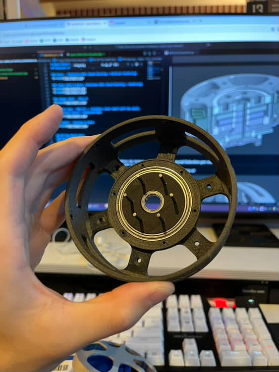
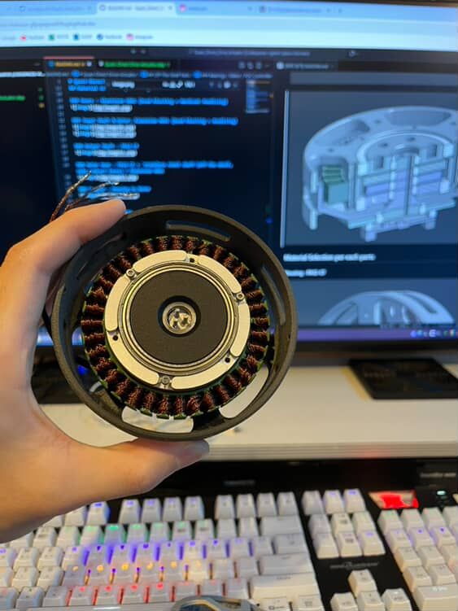
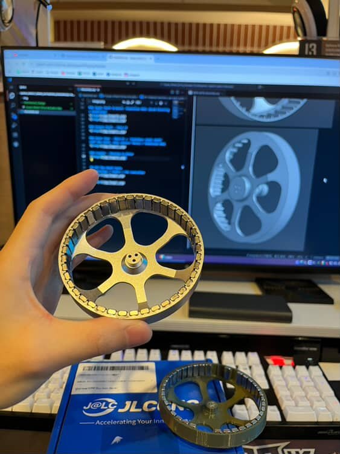

## Overview

  
  
  
  

---

## Materials & finishes

### Housing — PA12-CF

### Gears — Aluminum 6061 (bead blasted + anodized)

### Input shaft & rotor — Aluminum 6061 (bead blasted + anodized)

### Output shaft — PA12-CF

### Outer gear — PA12-CF or Aluminum 6061

### Coupler — Housing to rotor(PLA)

---

## Off-the-shelf parts
Common commercial parts used: bearings, stator, FOC controller, fasteners. See OFF_THE_SHELF_SPECIFICATIONS for part numbers and suppliers.

  
  

---

## Assembly images
These are assembly images(I'm preparing for more details)

  
  
  
  
  
  
  
  
  
  

---

I keep developing my actuators. It's ongoing project. please stay tuned!

